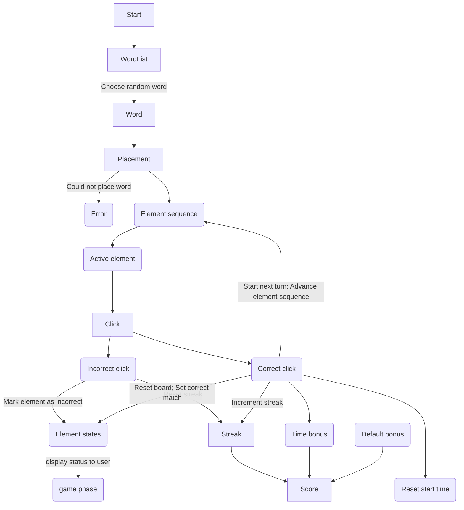

# Hewitt Learning

[Trello board](https://trello.com/b/cKhbgr5G/soft-eng-project) (you will need access to view it)

When commits are pushed/merged to the main branch, it is automatically deployed to https://hewitt-chemistry-games.netlify.app/

## Installation/Setup

You should have installed:

- [Node.js](https://nodejs.org/en/) 16.0 or newer
- [Git](https://git-scm.com/)

Then, using the [npm package manager (which comes preinstalled with Node.js)](https://www.npmjs.com/package/npm), you will need to install the [pnpm package manager](https://pnpm.io/), which we are using for this project. You can install pnpm by running `npm install -g pnpm`

Then, you can install the dependencies for this project by running `pnpm install` in the project folder.

## Running the project

After everything is installed, you can run the development server using:

```
pnpm dev
```

You can run the production build (creates a static site in the `dist` folder) using:

```
pnpm build
```

You can run the tests using:

```
pnpm test
```

## Architecture

This project is a static site, where all of the interactive behavior is implemented client-side. The UI framework is [Preact](https://preactjs.com/tutorial/) (if you are familiar with [React](https://reactjs.org/), all applicable knowledge will carry over). We are using [TypeScript](https://www.typescriptlang.org/) for type safety.

All the source code lives in the `src` folder. Its folder structure is:

- `components`: Holds Preact components for the UI, including current game board, info box, and the individual element info from the periodic table.
- `word-placement`: Holds logic related to the placement/fitting of words onto the periodic table grid. Used primarily with `vite.config.ts` to filter the wordList and `game-state.ts` to place the current word on the periodic table.
- `app.tsx`: The top-level rendered component.
- `game-state.ts`: Keeps track of all of the game state. Most of the game logic is in here. This file exports a `useGameState` [hook](https://preactjs.com/guide/v10/hooks) that allow it to be pulled into components (in our case, specifically the `PeriodicTable` component). The `useGameState` hook returns properties for all the externally-visible state values, as well as functions to modify the state.
- `main.tsx`: The entrypoint file, it renders the top-level component into the page.
- `periodic-table-data.ts`: Contains the raw data for the elements of the periodic table.
- `random-element-sequence-from-placement.ts`: Given a "placed" word, shuffles the "elements to find" into a random sequence of elements to be found.
- `score-calc.ts`: Given the current score and streak, and the amount of time it took to find the element, returns the new score and streak. The score is calculated as the sum of three parts: The base score for correctly finding an element, an increasing "streak bonus" for getting multiple elements in a row correctly without mistakes, and a "time bonus" for answering correctly quickly. The comments in that file more specifically describe the calculations for each of those bonuses.
- `index.css`: Contains global CSS styles, it is imported by the `main.tsx` component.
- `vite-env.d.ts`: Sets up globals for TypeScript.
- `vite.config.ts` retrieves the wordList for Element Decoder from DatoCMS, if the wordList on DatoCMS has been rebuilt. This file also checks for errors in the wordList retrieved from DatoCMS and updates the wordList to remove words from the list if they do not fit in the periodic table, based on our letter definitions. It is important to note that any word filtering done here does _not_ filter out inappropriate words. That responsibility lies on those who manage the DatoCMS wordList to not enter in inappropriate words.


Below is a graph of the high-level architecture of this project. We used rounded boxes with links to subgraphs to represent the different folders inside of `src`, unrounded boxes for specific files or components, and arrow cardinality to represent interaction between files and components (e.g. one-way arrows mean that the source of the arrow is not affected by the destination). Certain file names have been condensed for brevity, specifically within the `/src/components/` subfolder. This graph was made with the [Mermaid](https://mermaid.js.org/) diagramming and charting tool for GitHub/GitLab, and tested on Mermaid's [live testing website](https://mermaid.live/).


The following graph shows how each of the different states in our game-state logic file interact with each other. The graph begins at the `start` box, and runs until `element-sequence` is empty.


